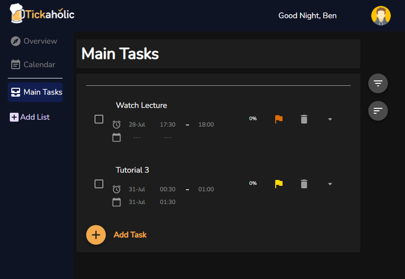

# Tickaholic

### Tired of being unable to plan your busy schedule? This is the web app for you!

---

## Overview

Tickaholic is a web app that strives for a balance between power and minimalism. It is catered to both power users and 
lightweight users. Power users, who are hungry for more control of their daily tasks, can allocate time to do a task and
track their progress in detail. On the other hand, lightweight users can simply use Tickaholic to stay posted on what 
tasks they have on hand and ensure they stick to their deadlines.

## Get Started
* Click [here](https://tickaholic-app.herokuapp.com/) to try our app now!
* [User Guide](https://docs.google.com/document/d/1WtkScKC9y7cu1hmrndKooKD1bZZl5nsc3Nn_p4X5Ab8/edit?usp=sharing)

## Motivation
 
No one is a stranger to To-do-lists. They help us plan out our activities for the week ahead and provide us with a means
of staying organized and on task. However, many of us end up using ones which fall short in providing certain desirable 
features. As a result, we often see ourselves jumping between multiple applications in order to keep track of even the 
simplest tasks. This poses a serious issue as using these applications now becomes counter-productive.
 
## Aim
 
As such, we hope to give users more autonomy in how they want to record and track their daily tasks to boost their user 
experience and productivity.

## Features
* Standard task system - Allow users to add, update and delete tasks
* Subtask system - Break down larger tasks to digestible components
* Filter & Sorting system - Customizable view settings to suit user’s needs
* Custom Properties - Users can add To-do dates to better plan their week or add their own tags to tasks
* List system - Allow users to create multiple groups of tasks
* Progress Bar - Allow a user to gauge how much of the task he/she has completed
* Interactive in-app Calendar - Allows users to update the timeline of a task without directly accessing the task node

## About Us
We are a team based in the [School of Computing, National University of Singapore](https://www.comp.nus.edu.sg/)

### Team Members
* Tan Teong Yu, Owen [[github](https://github.com/mslevis)]
* Wang Jun Hong [[github](https://github.com/WJunHong)]

Tickaholic is a web application developed for a first year self-directed, independent work course, [**Orbital**](https://orbital.comp.nus.edu.sg/).

Team Name:
BBLoh

Website Link:
https://tickaholic-app.herokuapp.com/

Proposed Level of Achievement:
Apollo 11
